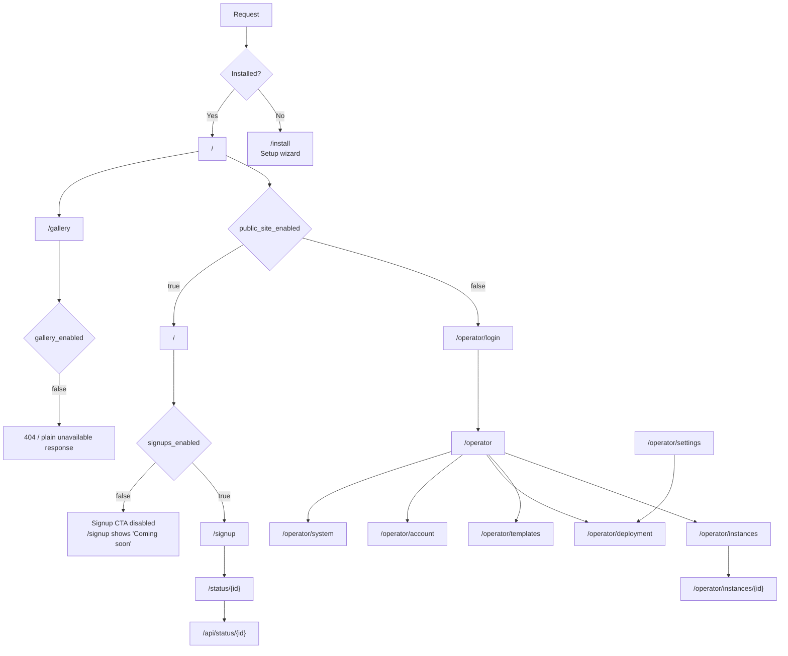

# Page Map

This document is an implementation-derived map of the current VoxelSwarm UI. It is based on the live route table in `index.php`, controller visibility checks, and the templates in `views/`.

## Visual Mind Model

## Shared Chrome

- Public layout: centered card layout, theme toggle, Inter font. Used by login, signup, status, gallery, and 404 pages.
- Landing page: standalone marketing page with its own nav, sections, CTA blocks, and theme toggle.
- Install page: standalone 3-step wizard, not wrapped in the public layout.
- Operator layout: sidebar with `Dashboard`, `Instances`, `Templates`, `Deployment`, `Account`, `System`; mobile top bar; theme toggle; logout; version badge.

## Public Pages

| Route | Visible When | What the Page Shows |
|------|--------------|---------------------|
| `/install` | App is not installed | 3-step setup wizard: system requirements, configuration, install result. The adapter select currently enables `local`, `nginx`, `forge`, `cpanel`, and `plesk`; other adapter entries are shown as coming soon. |
| `/` | Installed and `public_site_enabled=true` | Landing page with nav, hero, value props, 4-step explainer, operator pitch, CTA footer. Signup buttons render only when `signups_enabled=true`. |
| `/` | Installed and `public_site_enabled=false` | Redirects to `/operator/login`. |
| `/signup` | Installed and `public_site_enabled=true` | Public signup card. When `signups_enabled=true`, shows business name + email form. When `signups_enabled=false`, shows a "Coming soon" state. |
| `/status/{id}` | Any time the instance exists | Provisioning status card with polling, success CTA to `https://{subdomain}/_studio/`, or failure state. If the instance does not exist, shows a not-found state. |
| `/gallery` | `gallery_enabled=true` | Demo gallery grid of active instances with optional thumbnails from `storage/gallery/{slug}.jpg`. |
| `/gallery` | `gallery_enabled=false` | Not available. The controller returns a plain unavailable response instead of rendering the gallery page. |
| `/operator/login` | Installed and operator is logged out | Password-only login form with flash error state. |
| `404` | No route matched | Public 404 card with a back-to-home button. |

## Operator Pages

All `/operator/*` pages below require a valid operator session, except `/operator/login`.

| Route | Visible When | What the Page Shows |
|------|--------------|---------------------|
| `/operator` | Authenticated | Two modes. With zero instances: onboarding cards for template prep, deployment config, and first instance creation. Otherwise: summary cards, recent activity table, and `New Instance`. |
| `/operator/instances` | Authenticated | Search + status filters, total count, instance table, empty states, and `New Instance`. The controller also accepts a `type` query filter, but the current UI does not expose it. |
| `/operator/instances/{id}` | Authenticated and instance exists | Header with status badge, conditional pause/resume action, delete action, details card, operator notes, and provision log table. |
| `/operator/templates` | Authenticated | Flash messages, prepared versions list, activate/delete actions, ZIP list, process/delete actions, and first-template empty state. |
| `/operator/deployment` | Authenticated | Three cards: `Adapter`, `Public Site`, and `Notifications`. Includes `Test Connection` and `Send Test Email`. The current adapter dropdown exposes `local`, `nginx`, `forge`, `cpanel`, and `plesk`. |
| `/operator/account` | Authenticated | Operator email form and password change form. |
| `/operator/system` | Authenticated | `System Status`, `Update`, `Server Logs`, and password-confirmed `Danger Zone` actions for refresh/reset. |
| `/operator/settings` | Any installed state | Legacy URL. `index.php` redirects it to `/operator/deployment` with HTTP 301. It is not an active page anymore. |

## Page Actions And State Transitions

| Source | Action | Result |
|-------|--------|--------|
| Install wizard | Complete setup | Creates settings, auto-logs in operator, redirects to `/operator`. |
| Landing page | `Create Your Workspace` | Goes to `/signup` when signups are enabled. |
| Signup form | Submit valid form | Creates instance, redirects immediately to `/status/{id}`, provisions in background. |
| Status page | Poll success | Reveals workspace CTA to `/_studio/`. |
| Dashboard or Instances | `New Instance` | Opens shared modal; successful submit redirects to `/operator/instances/{id}`. |
| Instance detail | `Pause` / `Resume` / `Delete` | Calls instance actions, then reloads or redirects to the list. |
| Templates | `Process`, `Activate`, `Delete` | Redirect-back flows with flash message. |
| Deployment | Save | Persists adapter/public-site/mail settings and flashes success. |
| System | `Pull Latest`, log delete/download, refresh, reset | Executes maintenance flows and shows toast/status feedback. |

## Settings To Page Map

| Setting | Where It Is Edited | What It Controls |
|--------|--------------------|------------------|
| `public_site_enabled` | Install defaults + `/operator/deployment` | Whether `/` renders the landing page or redirects to `/operator/login`. |
| `signups_enabled` | Install defaults + `/operator/deployment` | Whether landing page CTAs point to signup and whether `/signup` shows the form or a "Coming soon" state. |
| `gallery_enabled` | Install defaults only in the current UI; manual/CLI otherwise | Whether `/gallery` is available. There is no operator dashboard toggle for this yet. |
| `base_domain` | Install + `/operator/deployment` | Instance subdomain generation, status CTA URL, landing copy examples, and gallery links. |
| `max_instances` | `/operator/deployment` | Blocks new public signups once the total instance count reaches the configured limit. |
| `control_panel_adapter` | Install + `/operator/deployment` | Which adapter provisions instances and whether the new-instance modal is subdomain-based or path-based. |
| `adapter_config` | Install + `/operator/deployment` | Adapter-specific credentials and filesystem/server config. |
| `mail_driver` | Install + `/operator/deployment` | Whether welcome/failure/test mail is sent, logged, or skipped. |
| `mail_config` | Install + `/operator/deployment` | SMTP connection and sender details. |
| `operator_email` | Install + `/operator/account` | Failure notifications, test email destination, and default email shown in the manual instance modal. |
| `operator_password_hash` | Install + `/operator/account` | Operator authentication and System page confirmation prompts. |
| `instances_path` | Set during install; updated indirectly by the local adapter when a custom path is verified | Where instances are stored and what the dashboard uses for storage calculations. |
| `template_path` | Set during install; updated when a template version is activated | Which prepared VoxelSite version the provisioner copies. |
| `app_key`, `version`, `installed_at` | System-managed | Encryption, version tracking, and install metadata. |

## Implementation Notes

- `views/operator/settings.php` and `src/Controllers/SettingsController.php` still exist in the repository, but the route is no longer active. Documentation should treat `/operator/deployment` and `/operator/account` as the real settings surfaces.
- The public gallery is partially implemented in code, but the current operator UI does not expose a gallery toggle or a "mark as gallery" action.
- The status polling endpoint `/api/status/{id}` is not a page, but it is part of the visible provisioning flow and should be documented alongside `/status/{id}`.
